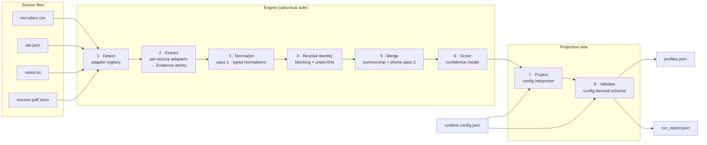

# Multi-Source Candidate Data Transformer — System Design & Decision Record

**Status:** Accepted — rev 2, incorporating design-review amendments · **Date:** 2026-08-13 · **Author:** Mohan Krishna
**Scope:** Full technical design for the Eightfold take-home (Problem.md), including every material decision as an ADR with options and trade-offs.

---

## 1. Requirements digest

### Functional
- **F1** — Ingest ≥2 source types: at least one structured (recruiter CSV, ATS JSON) and one unstructured (GitHub, LinkedIn, resume, recruiter notes).
- **F2** — Produce one canonical profile per candidate: fixed schema, normalized formats (E.164 phones, YYYY-MM dates, ISO-3166 alpha-2 country, canonical skill names).
- **F3** — Deduplicate/merge the same person across sources with field-level conflict resolution.
- **F4** — Record provenance `{field, source, method}` for every value and a confidence score per skill and per profile.
- **F5** — Accept a runtime config that reshapes output with no code changes: field subset, rename/remap via `from` paths (`emails[0]`, `skills[].name`), per-field normalization, provenance/confidence toggles, `on_missing: null | omit | error`.
- **F6** — Validate the projected output against the schema implied by the config before returning it.
- **F7** — Thin CLI surface (UI explicitly deprioritized by the problem).

### Non-functional
- **N1 Deterministic** — same inputs ⇒ byte-identical output; every field traceable to `(source, method)`.
- **N2 Robust** — a missing/garbage source degrades gracefully; unknown values become `null`, never invented.
- **N3 Scale** — reasonable on thousands of candidates (single machine; no distributed infra warranted).
- **N4 Explainable** — a reviewer can answer "why does this field have this value and this confidence?" from the output alone.

### Design north star
The problem states it directly: **wrong-but-confident is worse than honestly-empty.** Every tie in this document breaks toward emitting `null` (with an explanation in the run report) rather than a guess.

---

## 2. Architecture overview



**The load-bearing boundary** is between stages 1–6 (canonical side: fixed internal model, knows nothing about output shape) and stages 7–8 (projection side: pure function of `(canonical record, config)`, knows nothing about sources). The default schema is itself expressed as a shipped identity config, so both output modes exercise the same projection/validation code path — the separation is enforced by construction, not convention.

**Component responsibilities**

| Component | Responsibility | Must not know about |
|---|---|---|
| Adapter (per source) | Detect its format; emit `Evidence` atoms; contain its own failures | Other sources, merge policy, output config |
| Normalizers | One typed function per format (phone, date, country, skill, email, URL) | Which source a value came from |
| Identity resolver | Group evidence into candidate clusters | Field survivorship |
| Merger | Pick winners per field; keep losers as provenance alternatives | Output shape |
| Confidence scorer | Attach per-field and overall scores | Output shape |
| Projector | Interpret config paths over the canonical record | Sources, extraction methods |
| Validator | Enforce config-implied schema; collect per-record errors | Everything upstream |

---

## 3. Core data model

Everything extracted is born as an **Evidence** atom — the single abstraction that makes provenance free, confidence computable, and merge testable:

```
Evidence {
  field_path:   str          # canonical path, e.g. "emails", "experience.company"
  value:        Any          # normalized value (raw preserved alongside)
  raw_value:    Any          # exactly as seen in the source
  source_id:    str          # "ats.json", "recruiters.csv#row=17"
  source_type:  str          # "ats_json" | "recruiter_csv" | "notes_txt" | "resume"
  method:       str          # "direct_field" | "regex:email_v1" | "dict:skill_alias_v1" | "derived:date_range_sum"
  normalized:   bool         # False ⇒ value kept raw, flagged in report
  order_index:  int          # stable position within source, for deterministic tiebreaks
}
```

```
CanonicalProfile {
  candidate_id, full_name, emails[], phones[],
  location{city, region, country},
  links{linkedin, github, portfolio, other[]},
  headline, years_experience,
  skills[{name, canonical: bool, confidence, sources[]}],
  experience[{company, title, start, end, is_current, summary}],
  education[{institution, degree, field, end_year}],
  provenance[{field, source, method, alternatives[]}],
  field_confidence{path: float},
  overall_confidence
}
```

```
RunReport {
  run{as_of, default_region, config_path},          # every pinned input that can influence output
  sources[{source_id, status: ok|partial|skipped, records_read,
           evidence_emitted, errors[], flags[]}],   # flags: multi_identity_source, …
  merges[{cluster_id, member_sources[], match_keys_used[],
          flags[]}],                                # flags: suspect_shared_identifier, refused_union, …
  validation[{candidate_id, field, problem}],
  unparseable[{source_id, field, raw_value, reason}]
}
```

Schema refinements vs. the default (the problem invites refinement): `experience.is_current` flag; `skills[].canonical` flag; `provenance[].alternatives` (losing values are preserved, not erased); `field_confidence` map in addition to `overall_confidence`; internal dates carry precision (`{year, month|null}`) — see ADR-008; `candidate_id` is content-derived and deterministic — see ADR-016.

---

## 4. Decision records

Compact format: **Context → Options → Decision → Trade-offs/consequences.** Ratings are Low/Med/High unless stated.

### ADR-001 · Language & runtime: Python 3.11+

**Context.** Free choice of stack; workload is text munging, parsing, and one small interpreter; scale target is thousands of records on one machine.

| Option | Ecosystem fit | Speed to build | Runtime perf | Notes |
|---|---|---|---|---|
| **Python** | High — `phonenumbers`, `pydantic`, `pdfplumber`, `python-docx`, `pytest` | High | Sufficient | Richest text/parsing libraries; matches the domain's lingua franca |
| TypeScript/Node | Med-High — `zod`, `libphonenumber-js` | High | Sufficient | Equally defensible; weaker PDF/DOCX story |
| Go / Java | Med | Low-Med | Overkill | Verbose for exploratory text extraction; perf headroom unneeded at this scale |

**Decision.** Python 3.11+, `pydantic` for models, `phonenumbers` for E.164, `pytest` for tests, stdlib `argparse` for CLI. Dependencies kept to that short list.
**Trade-offs.** Slower than compiled options — irrelevant at N≈10³–10⁴ (see §6). Wins: every normalization problem here has a mature, well-tested Python library, which reduces the chance of subtle correctness bugs (the thing actually being graded).

### ADR-002 · Sources implemented: CSV + ATS JSON + recruiter notes; resume as stretch; GitHub/LinkedIn descoped

**Context.** Must cover ≥1 structured + ≥1 unstructured. Effort should concentrate on the merge engine, not adapters.

| Source | Cost | Value | Verdict |
|---|---|---|---|
| Recruiter CSV | Low | High — canonical structured baseline | **Build** |
| ATS JSON (foreign field names) | Low — a mapping table | High — demonstrates remapping + creates real conflicts for the merge demo | **Build** |
| Recruiter notes (.txt) | Low-Med — shared rule-based extractors | High — satisfies "unstructured" with best effort/value ratio | **Build** |
| Resume PDF/DOCX | Med — text extraction libs, then same extractors as notes | Med — second unstructured source, shared pipeline | **Stretch** |
| GitHub API | Med — network, auth, rate limits | Low-Med — breaks offline determinism unless responses are cached and replayed | **Descope, state why** |
| LinkedIn | High — no sanctioned API; scraping violates ToS | Low | **Descope, state why** |

**Decision.** Two structured + one (stretch: two) unstructured. Two structured sources is deliberate: having CSV and ATS JSON disagree on phone format, title, and company gives the conflict-resolution and provenance machinery something real to demonstrate.
**Trade-offs.** No live-API source in the demo. Consequence accepted: determinism and a reproducible demo outrank breadth of connectors; the adapter registry (ADR-013) leaves a clean slot for an API adapter backed by recorded responses.

### ADR-003 · Extraction strategy: deterministic rules; no live LLM in the pipeline

**Context.** Unstructured prose invites LLM extraction, but N1 demands byte-identical reruns and full traceability, and N3 makes per-candidate API calls slow/expensive. This is the central tension of the problem.

| Option | Deterministic | Explainable | Recall on prose | Cost/scale |
|---|---|---|---|---|
| **A. Rule-based** (regex, alias dictionaries, date grammars) | Yes | Yes — method string names the exact rule | Med | Free, fast |
| B. Live LLM extraction | No | Weak | High | Poor at N=10³⁺ |
| C. LLM with temp-0 + recorded/replayed responses, as one low-trust extractor | Yes (via replay) | Med | High | One-time cost |

**Decision.** Option A as the engine. Emails/phones/URLs via regex; skills via alias dictionary (ADR-010); experience dates via a small pattern grammar ("Jan 2020 – Present", "2019–2021", "03/2020"). Every Evidence atom's `method` field names the extractor and version (`regex:email_v1`), so extraction technique is auditable and feeds confidence (ADR-007).
**Trade-offs.** Rule recall on free prose is imperfect — missed values become `null`, which the problem explicitly prefers over guesses. Option C is architecturally accommodated (an LLM extractor would be just another adapter emitting Evidence with `method: "llm:extract_v1"` and a lower reliability weight) but is out of scope; saying so is part of the design.

### ADR-004 · Evidence-first internal model (extract → pool → merge as a pure function)

**Context.** Two shapes are possible: merge values into the profile as each source is read, or pool all Evidence first and make merging a pure function over the pool.

| Option | Provenance | Determinism | Testability | Memory |
|---|---|---|---|---|
| Merge-as-you-read | Bolted on | Order-sensitive by default | Hard — merge state entangled with I/O | Minimal |
| **Evidence pool → pure merge** | Free — every atom carries origin | Easy — sort the pool, then merge | High — merge is `f(evidence[]) → profile`, trivially unit-testable | ~KBs per candidate, fine at 10⁴ |

**Decision.** Evidence pool. The merge function receives a canonically sorted list of Evidence and returns a profile; given the same pool it cannot produce different output.
**Trade-offs.** Slightly more memory and one extra indirection. This is the single decision that makes F4 (provenance), N1 (determinism), and honest confidence scoring fall out naturally instead of being retrofitted — the design decision I would defend in the demo video.

### ADR-005 · Identity resolution: deterministic blocking + union-find, with a contradiction guard

**Context.** The same person appears in several sources; different people must not be fused. O(n²) fuzzy pairwise comparison is sloppy at N=10⁴ (10⁸ pairs) and hard to make deterministic.

| Option | Complexity | Determinism | False-merge risk |
|---|---|---|---|
| Pairwise fuzzy scoring | O(n²) | Threshold-sensitive | Med |
| ML entity resolution | High build cost | Low | Model-dependent |
| **Hash blocking on match keys + union-find** | ~O(n) | Yes | Low, controllable |

**Decision.** Match keys in strength order: **(1)** normalized email (NFC + lowercased; *for matching only*: plus-tags stripped and, on gmail/googlemail domains only, dots ignored — `mohan+jobs@x.com` matches `mohan@x.com`; original strings preserved in output); **(2)** E.164 phone — but only phones normalized in pass 1, i.e., carrying `+CC` or resolved via `--default-region` (ADR-009); raw national digits are never match keys, because the same 10 digits can be two different people in two countries; **(3)** soft key = casefolded full name + normalized current company, used only when a record carries neither strong key. Records sharing a key land in one union-find cluster.
**Canonical union order (determinism).** Candidate unions are processed in sorted order — key strength, then key value, then `source_id` — so which union a guard refuses is reproducible regardless of input file order (ADR-016).
**Contradiction guard.** Before a union is applied, the incoming record's name is checked against **every current member** of the target cluster, not just the record it matched — closing the transitive hole where A–B share an email, B–C a phone, and incompatible A and C would fuse through B. The predicate is deterministic: NFC + casefold + tokenize; two names are compatible iff their token sets overlap, where an initial (`m.`) matches any token it prefixes — "Mohan Krishna" ~ "M. Krishna" ~ "Krishna Mohan" are all compatible, "Mohan Krishna" vs "Priya Sharma" is not. Nicknames ("Bob"/"Robert") are deliberately incompatible: a false split is recoverable, a false merge is not. A refused union leaves both clusters intact and emits `suspect_shared_identifier` + `refused_union` flags in the run report — shared referral inboxes and switchboard phones are real.
**Record boundary & multi-identity guard.** Structured sources are one candidate per row/record. Unstructured files are assumed **one candidate per file** — and the assumption is guarded, not trusted: if an unstructured source yields ≥2 distinct strong identifiers of the same kind (e.g., two different emails in one notes file), its identity keys are excluded from blocking entirely, its evidence attaches to no cluster, and the source is flagged `multi_identity_source`. Without this guard, a notes file mentioning two people would union into both their clusters and transitively fuse them — the exact catastrophe this ADR exists to prevent, arriving through a side door.
**Trade-offs.** Conservative matching means occasional duplicates survive (same person, no shared key, name spelled differently), and a multi-identity source contributes nothing rather than something wrong. Accepted: a duplicate or an unattached source is recoverable; a fused profile silently poisons hiring decisions. No phonetic/embedding name matching (descope, §7).

### ADR-006 · Field survivorship: type-aware rules with a total, deterministic ordering

**Context.** After clustering, conflicting values need a winner per field, with the loser preserved, and reruns (including shuffled input file order) must pick identical winners.

**Decision.** Compare on **normalized** values (so `"GOOGLE"` vs `"Google"` is not a conflict). Then, per field type:

| Field type | Rule |
|---|---|
| Scalars (name, headline, title…) | Winner by ordered comparison: source trust rank → method reliability rank → in-band recency (a timestamp carried *inside* the data, e.g., ATS `updated_at`; file mtime is never consulted — ADR-016) → `source_id` ascending → `order_index` ascending. The last two exist purely to make ties deterministic. |
| `location{}` | **Atomic**: one winning evidence supplies the whole struct — most complete struct first, then the scalar ordering. Merging city/region/country independently could emit city "Bengaluru" + country "US", a composite no source ever claimed — invented data by another route |
| Sets (emails, phones, skills, links) | Union + dedupe post-normalization; ordered by (element confidence desc, normalized value asc) — so `emails[0]` deterministically means "most trusted email", which the example config's `primary_email` depends on |
| `experience[]` | Sub-merge: entries with same normalized company and overlapping date ranges (year-only ranges span their whole year) are the same job → merge fields by the scalar rule; two *dateless* entries merge only if titles also match; else append — so a promotion (same company, sequential ranges, different titles) correctly stays two entries. Sorted by start date desc for stable output. |
| `education[]` | Same sub-merge keyed on institution + end_year |
| `years_experience` | **Derived** from merged experience ranges (union of intervals, overlaps not double-counted) in preference to any stated value; a stated value that disagrees is recorded as an alternative and lowers field confidence. Interval arithmetic: open-ended (`is_current`) ranges close at the pinned `as-of` date (ADR-016), never the wall clock; year-only starts count from January and year-only ends through December (a documented upper bound); result rounded to 1 decimal via `Decimal` `ROUND_HALF_UP` |

Source trust ranks (tunable constants, documented in code): ATS 0.9 · CSV 0.85 · resume 0.7 · notes 0.5. Method reliability: `direct_field` 1.0 · `regex` 0.9 · `dict` 0.85 · `derived` 0.6.
**Trade-offs.** A static trust table is a judgment call, not learned truth — but it is inspectable, explainable, and deterministic, which is what N1/N4 demand. Losers are never discarded: they land in `provenance[].alternatives`, so the output itself shows what was overruled.

### ADR-007 · Confidence model: transparent noisy-OR corroboration, not pseudo-probability

**Context.** Confidence must be deterministic, explainable from the output, and must reward independent agreement while punishing contradiction.

| Option | Explainable | Honest | Build cost |
|---|---|---|---|
| Calibrated Bayesian model | Low for a reviewer | Requires data we don't have | High |
| ML-scored confidence | No | No | High |
| **Heuristic noisy-OR over evidence strengths** | Yes — arithmetic a reviewer can redo by hand | Yes, if documented as ordinal | Low |

**Decision.** Evidence strength `s = source_trust × method_reliability`. For the winning value of a field:

```
agreement  = 1 − Π (1 − sᵢ)   over evidence agreeing with the winner   (noisy-OR: two weak agreeing sources beat one alone)
support    = Σ s_agree / Σ s_all                                        (contradiction penalty)
confidence = agreement × support
overall    = Σ w_f · conf_f / Σ w_f   over core fields, conf_f = 0 when the field is empty
```

**Set-valued fields** (emails, phones, skills, links) score per element: a source that does not list an element is a partial view, not a contradiction — so elements take pure noisy-OR over the sources containing them, with `support = 1`. The winner-vs-losers `support` penalty applies only where a single value had to be chosen.
Core-field weights: identity fields (name, emails) weighted highest. An empty field contributes 0 to `overall` — deliberately: `overall_confidence` measures *how much the whole profile can be trusted for downstream use*, and an incomplete profile warrants less trust even when its emptiness is honest. Per-field confidence, meanwhile, never punishes emptiness (empty fields simply have no score).
**Trade-offs.** These are ordinal scores, not calibrated probabilities, and the README will say so. Chosen because a reviewer can trace any number to `(trust table, method table, agreement arithmetic)` — which is exactly N4. One acknowledged blind spot: noisy-OR assumes source independence — an ATS originally seeded from the recruiter CSV corroborates nothing, and no offline system can detect that; documented as a limitation rather than papered over.

### ADR-008 · Date semantics: preserve precision; never coerce year-only to January

**Context.** Schema says dates as `YYYY-MM`. Real inputs contain "2019", "Jan 2020 – Present", and ambiguous `03/04/2021`.

**Decision.** Internal representation `{year, month|null}`. Rendering: `YYYY-MM` when month is known, `YYYY` when only the year is (a documented refinement of the default schema — the problem invites refinement, and coercing "2019" to "2019-01" is textbook wrong-but-confident). "Present"/"Current" ⇒ `end: null` + `is_current: true`. Numeric `a/b/yyyy` where both `a,b ≤ 12` and source locale is unknown ⇒ month is ambiguous ⇒ month `null`, raw preserved, entry logged in `run_report.unparseable`.
**Trade-offs.** Consumers must accept two date grain values. The alternative silently manufactures a month for every year-only date in the corpus — rejected on the north star.

### ADR-009 · Phone normalization: explicit region ladder; no silent +1

**Context.** E.164 requires a country. Sample data will contain national-format numbers with no country code.

**Decision.** Parse with `phonenumbers`, in **two passes** — the obvious single-pass region ladder hides a stage cycle (resolving region from the candidate's location needs the merged cluster, but identity resolution consumes normalized phones as match keys), so normalization is split around the merge:
- **Pass 1 (stage 3, pre-merge):** normalize numbers that carry `+CC` or resolve via the operator-set `--default-region`. Only these participate in blocking as match keys (ADR-005) — matching on raw national digits would be unsafe anyway, since the same digits exist in many countries.
- **Pass 2 (stage 5, post-merge):** re-attempt leftover national numbers using their cluster's resolved location country. Late-normalized phones join `phones[]` with full provenance but never retroactively trigger re-clustering — one resolution round, deterministic.
- **Still unresolvable:** the number does **not** enter `phones[]` — preserved raw in provenance and listed in `run_report.unparseable` with reason `no_region_context`.

**Trade-offs.** Some genuine numbers are withheld from the canonical list when context is missing, and a pass-2 phone cannot help clustering even where it might have. Accepted: `phones[]` guarantees "everything here is valid E.164", the raw value is never lost, and no stage cycle exists. Defaulting to US, the common shortcut, is precisely the silent-guess failure the problem warns about.

### ADR-010 · Skills canonicalization: curated alias dictionary; unknowns preserved and flagged

**Context.** "JS", "Javascript", "JS (ES6)" must converge; unknown skills must not be dropped or force-mapped.

| Option | Deterministic | Coverage | Risk |
|---|---|---|---|
| Embedding similarity | No (model/version drift) | High | Wrong-but-confident mappings |
| External taxonomy (ESCO/O*NET) | Yes | High | Heavy integration for a take-home |
| **Curated alias dictionary + fold pipeline** | Yes | Med (grows with data) | Honest gaps |

**Decision.** Normalization fold (casefold → strip punctuation/version suffixes: "Python 3.10" → "python") → alias dictionary lookup (`js`, `javascript`, `es6` → `javascript`). Hits emit `{name, canonical: true, method: "dict:skill_alias_v1"}`. Misses are **kept verbatim** with `canonical: false` and reduced confidence — never dropped, never guessed into the nearest known skill.
**Trade-offs.** Dictionary coverage is bounded by curation effort; fine for sample data, and the `canonical: false` population is itself the worklist for growing the dictionary.

### ADR-011 · Projection path DSL: exactly four constructs, hand-rolled

**Context.** The config's `from` keys require `field`, `nested.path`, `arr[0]`, and `arr[].sub` (map semantics). Nothing in the spec requires more.

| Option | Spec fit | Failure modes | Cost |
|---|---|---|---|
| JSONPath / JMESPath library | Superset | Surprising semantics (filters, wildcards) become untested surface; config errors surface at project time | Dependency |
| **Mini-DSL: `name`, `a.b`, `a[i]`, `a[].b`** | Exact | Grammar so small it can be exhaustively tested; unknown paths rejected at **config load** | ~60 lines |

**Decision.** Hand-rolled four-construct grammar; at most one `[]` per path (it maps, producing an array). Because the grammar is closed, every `from` path is validated against the canonical schema **when the config loads** — a typo like `emials[0]` fails fast with exit code 2 before any candidate is processed. Output-side `path` values use a narrower grammar: dotted nesting is allowed (`contact.email` builds a nested object); `[]`/`[i]` are rejected. `from` defaults to `path` when omitted (the example config's `full_name` relies on this). Config load also checks **type coherence**: the declared `type` (closed vocabulary: `string`, `number`, `boolean`, `object`, `string[]`, `number[]`, `object[]` — the array-of-object forms exist so the default identity config can express `skills`/`experience`/`education`) must match the canonical path's type, and the declared `normalize` must be applicable to it — `E164` on `full_name` is a load-time error caught *semantically* (E164 only reads from `phones`), since both fields are strings and a type check alone would let it through.
**Trade-offs.** Users can't express filters or slices. Accepted until a requirement exists; growing a mini-DSL is easier than un-supporting accidental JSONPath features.

### ADR-012 · Projection & validation: fixed operation order, two validation layers, `error` doesn't crash the batch

**Context.** F5/F6 need precise semantics, especially `on_missing` interplay with `required`.

**Decision.** Per output field, in order: resolve `from` path → apply per-field `normalize` (registry: `E164`, `canonical`, `YYYY-MM`, `ISO3166`, `lower`; every normalizer is **idempotent**, since projection routinely re-normalizes already-canonical values) → if empty, apply `on_missing` (`null` → emit null · `omit` → drop key · `error` → record a validation error) → type-check against declared `type`. Two definitions that remove ambiguity: **empty** means null/absent — an empty array is a *present* value and passes through untouched; a **normalization failure** at projection time (value exists but will not normalize) is treated as missing — `on_missing` applies and the raw value lands in `run_report.unparseable` — never a crash.
Rules: `required` + missing is **always** a validation error regardless of `on_missing`. A record with validation errors is excluded from `profiles.json` and listed in `run_report.validation` — one bad candidate never aborts the batch (N2), and `on_missing: "error"` means "flag it", not "crash".
Two validation layers: **(1) config load** — paths exist (ADR-011), types coherent, normalizer names known, duplicate output paths rejected; **(2) output** — a JSON Schema is *generated from the config* and every projected record validated against it, so F6 is satisfied against the *requested* schema, not a hardcoded one.
When provenance/confidence toggles are on, provenance entries are **re-keyed to output field names** (`primary_email`, not `emails[0]`) — provenance that points at fields the consumer can't see is noise. Confidence, when included, has a defined shape: per record `confidence: {overall, fields: {<output path>: score}}`, keyed by output names and included in the generated schema. Load-time validation additionally rejects an empty `fields` list; emitted `profiles.json` is sorted by `candidate_id` (ADR-016).
**Trade-offs.** Generating a schema from the config is extra machinery vs. hand-checking, but it's what makes "default schema = identity config" (§2) a single code path instead of two.

### ADR-013 · Robustness: per-source fault boundaries + always-emitted run report

**Context.** N2: truncated JSON, shifted CSV columns, an empty PDF, or a missing file must not take down the run — and silent skipping is almost as bad as crashing.

**Decision.** Adapter registry with deterministic detection (extension + content sniff; both recorded). Each adapter runs inside a fault boundary: any exception ⇒ source marked `skipped` (or `partial` for row-level failures like a malformed CSV row), error captured in `RunReport.sources[]`, pipeline continues with remaining evidence. The run **always** emits both `profiles.json` and `run_report.json`. Exit codes: `0` profiles emitted (report may contain warnings) · `2` unusable config or zero readable sources. No exit code for "some source failed" — that is a reported condition, not a process failure.
**Trade-offs.** Broad exception boundaries can mask adapter bugs during development; mitigated by a `--strict` dev flag that re-raises instead of containing.

### ADR-014 · Surface: CLI only

**Context.** Problem explicitly blesses a CLI and warns against spending time on UI polish.

**Decision.**

```
python -m transformer run \
  --input samples/ \
  --config configs/default.json \
  --out out/profiles.json \
  --report out/run_report.json \
  [--as-of 2026-08] [--default-region IN] [--strict]
```

`configs/default.json` (identity projection of the canonical schema) and at least one custom config (e.g., the problem's example) ship in the repo. No UI.
**Trade-offs.** None material; the demo video shows two CLI runs and diffs the outputs.

### ADR-015 · Scale & determinism mechanics: in-memory, O(n) blocking, sorted iteration everywhere order matters

**Context.** N=10³–10⁴ candidates, single machine, byte-identical reruns even when input files are listed in a different order.

**Decision.** Everything in memory (≈ a few KB of evidence per candidate ⇒ tens of MB at 10⁴ — no DB, no streaming framework). Identity resolution is hash-blocking + union-find (~O(n·k), never O(n²) pairwise). **Determinism invariants:** the evidence pool is canonically sorted before merge; all dict iteration that affects output order is over sorted keys; output arrays have defined sort orders (experience by start desc, skills by name); JSON is written with `sort_keys=True` and fixed separators. These invariants get their own test: run the pipeline twice, once with shuffled input file order, and byte-compare outputs.
**Trade-offs.** In-memory design won't stretch to millions of candidates — out of stated scope; the evidence-pool model shards naturally by cluster key if that day comes.

### ADR-016 · Determinism protocol: no clock, no filesystem metadata, content-derived identity

**Context.** Design review found four independent mechanisms that would silently break N1 ("same inputs ⇒ byte-identical output"): wall-clock use in `years_experience`, file-mtime "recency", order-dependent union refusals, and unspecified `candidate_id` generation. Determinism is a protocol, not a property — every input that can influence output must be pinned, and each leak would have surfaced only as a flaky byte-compare test months later.

**Decision.**
- **Pinned as-of date.** All date arithmetic that needs "now" (closing open-ended `is_current` ranges) uses `--as-of YYYY-MM`; default = the maximum date observed anywhere in the inputs (content-derived, hence deterministic). Recorded in `run_report.run.as_of`. No code path may read the system clock.
- **In-band recency only.** Survivorship recency (ADR-006) comes exclusively from timestamps *inside* the data (e.g., ATS `updated_at`). Filesystem metadata — mtime, listing order, path casing — never influences output.
- **Content-derived `candidate_id`.** `sha256` over the cluster's lexicographically smallest normalized strong identifier, prefixed by kind (`email:…`, else `phone:…`), truncated to 16 hex chars; clusters with neither strong key fall back to `name+company:…`. Stated trade-off: if a later run adds a source carrying a *stronger* key for a cluster, its id changes — acceptable for a batch tool, documented in the README.
- **Canonical processing order.** Unions execute in sorted order (ADR-005); the evidence pool is sorted before merge (ADR-004); all output arrays and JSON keys have defined sort orders (ADR-015); `profiles.json` records sort by `candidate_id`.
- **String intake normalization.** Every string is NFC-normalized at extraction and casefolded (not merely lowercased) for comparisons — otherwise "José" (NFC) vs "José" (NFD) becomes a phantom name conflict between byte-different, visually identical strings.
- **Pinned numerics & bytes.** `years_experience` rounds via `Decimal` `ROUND_HALF_UP`; output written as UTF-8 with `\n` newlines and fixed JSON separators, so byte-comparison tests pass on Windows despite CRLF defaults.

**Trade-offs.** A handful of rules to remember instead of one. The alternative — discovering each leak when the byte-compare test flakes across a month boundary or after a file copy — is exactly the class of silent nondeterminism this ADR exists to name and kill.

---

## 5. Edge-case handling matrix

| # | Edge case | Handling | Where decided |
|---|---|---|---|
| 1 | Conflicting scalar across sources ("Google" vs "Alphabet") | Survivorship ordering picks winner; loser kept in `provenance.alternatives`; `support` factor lowers confidence | ADR-006/007 |
| 2 | Phone without country code | Region ladder; if unresolvable, excluded from `phones[]`, raw preserved, reported | ADR-009 |
| 3 | Garbage source (truncated JSON, binary junk, missing file) | Fault boundary: source `skipped`, run continues, report explains | ADR-013 |
| 4 | Same email, different people (shared inbox) | Contradiction guard blocks merge; `suspect_shared_identifier` flag | ADR-005 |
| 5 | "Present" / overlapping jobs | `end: null` + `is_current`; `years_experience` from interval union — no double counting | ADR-006/008 |
| 6 | Year-only / ambiguous `03/04/2021` dates | Precision preserved (`YYYY`); ambiguous month ⇒ null + reported | ADR-008 |
| 7 | Unknown skill ("Quantum Basket Weaving") | Kept verbatim, `canonical: false`, lower confidence — never dropped or force-mapped | ADR-010 |
| 8 | Config typo (`emials[0]`) | Rejected at config load, exit 2, before any processing | ADR-011/012 |
| 9 | Duplicate rows inside one source | Evidence dedupes on (field, normalized value, source); corroboration counted once per source | ADR-007 |
| 10 | Notes file mentioning two people (≥2 distinct emails) | Multi-identity guard: identity keys excluded from blocking, evidence attaches to no cluster, `multi_identity_source` flag — prevents transitive person-fusion | ADR-005 |
| 11 | Location chimera (city from one source, country from another) | `location{}` merges atomically — one winning source supplies the whole struct | ADR-006 |
| 12 | Same name in NFC vs NFD Unicode ("José") | NFC at intake + casefold for matching — no phantom conflict | ADR-016 |
| 13 | Promotion: same company, sequential ranges, different titles | Two experience entries (append); dateless duplicates merge only when titles also match | ADR-006 |
| 14 | Duration of a current job ("Present") | Interval closes at the pinned `as-of` date, never the wall clock | ADR-016 |
| 15 | Candidate missing a field the config marks `required` (notes-only, no email) | Record excluded from `profiles.json`, listed in validation report; batch continues | ADR-012 |

---

## 6. Testing strategy

| Layer | Tests |
|---|---|
| Normalizers (unit) | Table-driven cases per normalizer: phones (with/without CC, junk), dates (all grammar forms + ambiguous), country aliases, skill folds |
| Merge (unit) | Pure-function tests: crafted evidence pools → expected winners, alternatives, confidence arithmetic verified by hand |
| Identity (unit) | Merge on email/phone; soft-key merge; contradiction guard refusal, including the transitive A–B–C case; multi-identity source exclusion; name-compatibility predicate table (initials, token reordering, nicknames) |
| Projection (unit) | All four path constructs; `on_missing` × `required` matrix; provenance re-keying; empty-array vs missing; normalize-failure ⇒ missing; load-time type/normalizer coherence rejections |
| End-to-end | Sample inputs → **gold profile** fixture comparison (byte-level); garbage-source run still exits 0 with report |
| Determinism | Same inputs twice + shuffled file order + touched mtimes → byte-identical outputs; explicit `--as-of` pins current-job durations (verified against two different fake clocks) |

---

## 7. Deliberate descopes (stated, not silent)

1. **Live GitHub/LinkedIn fetching** — network breaks offline determinism; LinkedIn has no sanctioned API. Adapter slot exists for a recorded-response API source.
2. **LLM extraction** — non-deterministic live; architecturally a plug-in Evidence emitter with its own trust weight (ADR-003), not built.
3. **Fuzzy/phonetic/embedding name matching** — false-merge risk outweighs dedupe gain at this scale; email/phone keys cover the sample data.
4. **UI** — CLI per problem guidance.
5. **Cross-cultural name parsing** (given/family splitting) — full_name kept whole.
6. **Config expressiveness beyond the four path constructs** — grown on demand, not speculatively.

## 8. Risks & open questions

- **Alias dictionary coverage** is the weakest link for skill canonicalization on unseen data; `canonical: false` entries are the self-generating worklist.
- **Trust-table values are judgment calls** — documented as tunable constants; the honest claim is "inspectable and consistent", not "optimal".
- **Correlated sources inflate corroboration** — an ATS seeded from the recruiter CSV corroborates nothing; undetectable offline, so documented as a limitation (ADR-007) rather than hidden.
- **Sample inputs not yet in hand** — adapters are designed against the problem statement's field lists; adapter mappings may need a small adjustment when samples arrive (isolated to the adapter layer by design).
- **One-pager compression** — this document distills to: pipeline diagram, canonical schema + formats, ADR-005/006/007 (merge & confidence), ADR-011/012 (config), ADR-016 (determinism protocol), five rows of §5, and §7.
