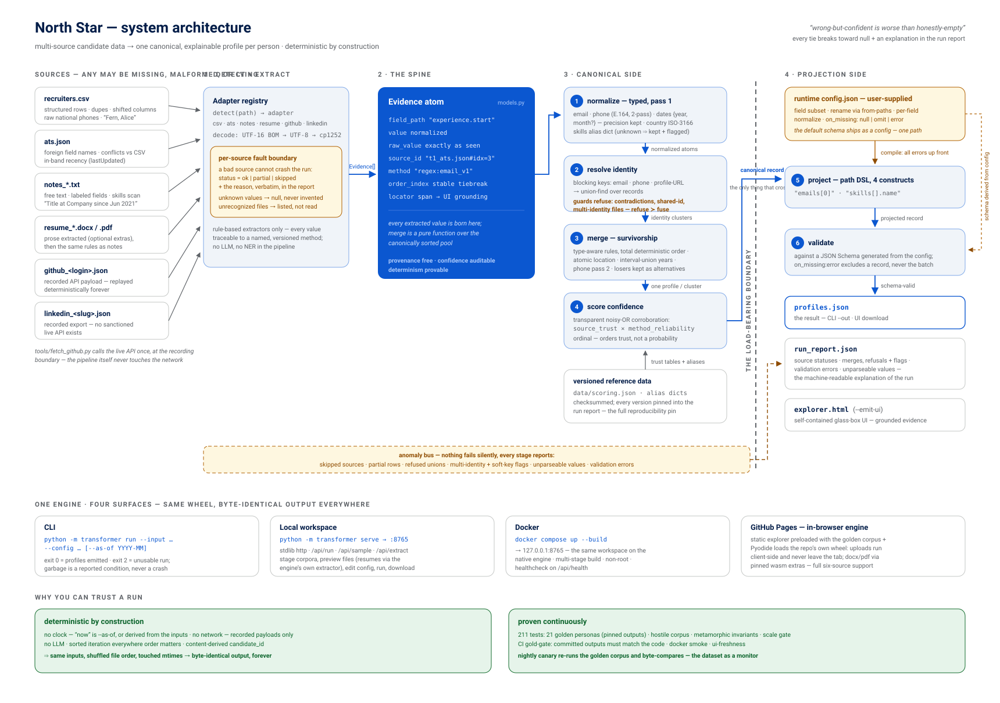

<div align="center">
    
    <h1>North Star: Multi-Source Candidate Data Transformer</h1>
</div>

[](https://github.com/MohanKrishnaGR/NorthStar/actions/workflows/ci.yml)
[](https://github.com/MohanKrishnaGR/NorthStar/actions/workflows/pages.yml)
[](https://github.com/MohanKrishnaGR/NorthStar/actions/workflows/canary.yml)


A project by <em>Mohan Krishna G R</em> —
[mohankrishnagr.github.io](https://mohankrishnagr.github.io)

Messy candidate data in: recruiter CSV, ATS JSON, free-text notes, resumes
(docx/pdf), recorded GitHub/LinkedIn payloads. One canonical, deduplicated
profile per candidate out, with per-field provenance, auditable confidence,
and a runtime config that reshapes the output with **no code changes**.

Guiding rule, from the problem statement: **wrong-but-confident is worse than
honestly-empty.** Every tie breaks toward `null` plus an explanation in the
run report — never a guess.

- **Live demo:** https://mohankrishnagr.github.io/NorthStar/
<!-- - **Demo video (~2 min):** _[add link before submitting]_
- **Design one-pager:** submitted separately (PDF) — the full decision
  record behind this build covers every material choice with options and
  trade-offs -->

## Contents
- [Run it](#run-it) — [live site](#1--zero-install--the-live-site) ·
  [docker](#2--docker) · [CLI](#3--cli) ·
  [local workspace](#4--local-workspace--self-contained-explorer) ·
  [tests](#tests)
- [How it works](#how-it-works)
- [CLI flags](#cli-flags)

## Run it

### 1 · Zero install — the live site

Open https://mohankrishnagr.github.io/NorthStar/ — the glass-box explorer,
preloaded with the 21-persona golden corpus. Click any profile field and its
evidence highlights inside the original source; expand any confidence score
into the arithmetic behind it.

**⚙ workspace** loads the *real engine* in your browser (Pyodide + this
repo's wheel, ~15 MB one-time): stage `⤓ goldens/t1` or drop your own files,
preview each one (CSV as a table, JSON pretty-printed, resumes as the
engine's own extracted text), pick or edit the projection config, run, then
download `profiles.json` and the run report. Uploads never leave the tab.

### 2 · Docker

```bash
docker compose up --build
```

→ http://127.0.0.1:8765 — the same workspace against the native engine
(multi-stage build, non-root, healthcheck).

### 3 · CLI

```bash
pip install .            # Python 3.11+ · deps: phonenumbers, jsonschema
pip install .[resume]    # optional: docx/pdf resume support

# Default canonical output + run report
python -m transformer run --input samples --config configs/default.json \
  --out out/profiles_default.json --report out/run_report_default.json

# Custom projection (the problem statement's example config)
python -m transformer run --input samples --config configs/recruiter_view.json \
  --out out/profiles_recruiter_view.json --report out/run_report_recruiter_view.json
```

`out/` is committed and contains exactly what these commands produce —
`tests/test_gold.py` fails if code and committed outputs ever drift.

### 4 · Local workspace & self-contained explorer

```bash
python -m transformer serve      # stdlib-only server → http://127.0.0.1:8765

python -m transformer run --input goldens/t1 --config configs/default.json \
  --out out/_p.json --report out/_r.json --as-of 2026-08 \
  --emit-ui out/explorer.html    # one self-contained HTML file, no server
```

The built UI template is committed, so `--emit-ui` needs no Node. (After UI
edits: `cd ui && npm install && cd .. && python tools/build_ui.py`.)

### Tests

```bash
pip install .[dev] && python -m pytest -q     # 211 tests, ~4 s
```

Unit · end-to-end · determinism (shuffled file order, touched mtimes →
byte-identical output) · 21 golden personas with pinned expected outputs ·
hostile corpus · metamorphic invariants · scale gate. CI re-proves each claim
in a named job (gold-gate, determinism, docker smoke, …) and a **nightly
canary** byte-compares the golden corpus — the dataset doubles as a
production monitor.

## How it works

<div align="center">
    
</div>

```
detect -> extract -> normalize (pass 1) -> resolve identity -> merge
       (+ phone pass 2) -> score confidence -> project (config) -> validate
```

- Every extracted value is born an **Evidence atom**
  `{field, value, raw_value, source, method}`; merging is a pure function
  over the canonically sorted pool. That one decision makes provenance free,
  confidence auditable, and determinism provable.
- **Identity:** deterministic blocking (email / phone / profile-URL keys) +
  union-find, with contradiction and multi-identity guards that *refuse* a
  merge rather than fuse two people. A file naming two people loses its
  identity keys and is flagged (`multi_identity_source`).
- **Confidence:** transparent noisy-OR over source-trust ×
  method-reliability (tables with rationale in `transformer/constants.py`).
  Scores are ordinal — they order trust, they are not probabilities.
- **Projection:** the default schema is itself a shipped config, so default
  and custom outputs exercise the same projection + validation path; output
  is validated against a JSON Schema *generated from the config*.
- **No clock, no network, no LLM in the pipeline.** `--as-of` pins "now"
  (default derives from the inputs); GitHub's API is exercised once at the
  recording boundary (`tools/fetch_github.py`) and replayed forever; rule
  extractors keep every value traceable to a named method.

### CLI flags

| Flag | Meaning |
|---|---|
| `--as-of YYYY-MM` | Pins "now" for open-ended durations. Default: derived from the inputs — the system clock is never consulted. |
| `--default-region IN` | Region for phones without `+CC`. Unset ⇒ such phones stay raw and are reported, never guessed. |
| `--strict` | Development aid: re-raise adapter errors instead of containing them. |

Exit codes: `0` profiles emitted (report may carry warnings) · `2` unusable
config / zero readable sources. A garbage source is a *reported condition*,
never a crash.


